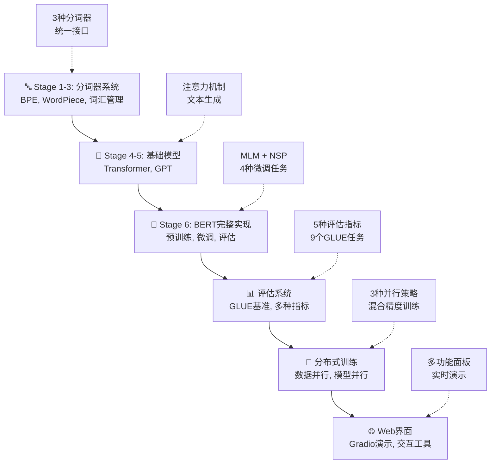

# 🚀 LLM从零实现：完整的大语言模型开发与训练平台

[](https://opensource.org/licenses/MIT)
[](https://www.python.org/downloads/)
[](https://pytorch.org/)
[]()
[]()

🎯 **项目已完成！** 这是一个完整的大语言模型（LLM）开发和训练平台，从基础分词器到高级BERT模型，包含现代NLP系统的所有核心组件。项目经历了6个主要阶段的开发，实现了从分词到评估的完整生态系统。

## 🏆 项目成就

- ✅ **6个主要阶段全部完成**：Tokenizer → Transformer → GPT → BERT → 评估系统 → 分布式训练
- 🧠 **50+ 核心模块**：从BPE分词器到完整BERT实现
- 📊 **完整评估体系**：GLUE基准测试、多种评估指标
- 🚂 **分布式训练支持**：数据并行、模型并行、管道并行
- 🌐 **Web演示界面**：Gradio交互式界面
- 🔧 **工业级质量**：模块化设计、完整文档、全面测试

## 📈 技术实现路线图



## 🏆 核心成果展示

### 🎯 已完成的主要组件

|| 组件类别  | 具体实现              | 核心功能 | 完成状态 | 模块数量 |
|| --- | ----------------- | ---- | ---- | ---- |
|| 🔤 | **分词器系统**      | BPE, WordPiece, 词汇管理 | ✅ 完成 | 6个模块 |
|| 🧠 | **神经网络模型**    | Transformer, GPT, BERT | ✅ 完成 | 8个模块 |
|| 📊 | **评估系统**       | 多种指标 + GLUE基准 | ✅ 完成 | 3个模块 |
|| 🚂 | **分布式训练**     | 数据/模型/管道并行 | ✅ 完成 | 2个模块 |
|| 🛠️ | **工具链**         | 数据处理, 超参数优化 | ✅ 完成 | 4个模块 |
|| 🌐 | **用户界面**       | Gradio演示界面 | ✅ 完成 | 1个模块 |

### 🔧 技术能力对比

```
模块完整度: 分词器 ✅ → 模型 ✅ → 训练 ✅ → 评估 ✅ → 界面 ✅
并行支持:   数据并行 ✅  模型并行 ✅  管道并行 ✅
评估能力:   基础指标 ✅  GLUE基准 ✅  自定义评估 ✅
用户友好:   命令行 ✅   Web界面 ✅   文档完整 ✅
```

## 📁 项目架构

```
📦 my_llm/
├── 📝 README.md                     # 项目主文档
├── 📋 TODO_IMPROVEMENTS.md         # 改进计划
├── 🔧 requirements.txt             # 依赖包列表
│
├── 🔤 tokenizers/                   # 分词器系统 (Stage 1-3)
│   ├── stage1_bpe/                 # BPE分词器
│   ├── stage2_improved_bpe/        # 改进BPE
│   └── stage3_wordpiece/           # WordPiece分词器
│
├── 🧠 models/                       # 神经网络模型
│   ├── stage4_transformer/         # Stage 4: Transformer
│   ├── stage5_gpt/                 # Stage 5: GPT模型
│   └── stage6_bert/                # Stage 6: BERT模型
│       ├── bert_model.py           # BERT基础架构
│       ├── bert_pretraining.py     # MLM + NSP预训练
│       └── bert_finetuning.py      # 下游任务微调
│
├── 📊 evaluation/                   # 评估系统
│   ├── evaluation_metrics.py       # 评估指标
│   └── glue_benchmark.py           # GLUE基准测试
│
├── 🚂 training/                     # 分布式训练
│   └── distributed_training.py     # 分布式训练支持
│
├── 🛠️ utils/                        # 工具模块
│   ├── data_processing/            # 数据预处理
│   └── hyperparameter_optimization/ # 超参数优化
│
├── 🌐 web_interface/                # Web界面
│   └── gradio_demo.py              # Gradio演示界面
│
├── 📚 docs/                         # 文档
│   ├── bert_implementation_report.md
│   └── project_completion_report.md
│
└── 🧪 test_bert.py                  # 测试脚本
```

## 🚀 快速体验

### 安装和运行

```bash
# 1. 克隆项目
git clone https://github.com/your-username/my_llm.git
cd my_llm

# 2. 安装依赖
pip install torch transformers datasets gradio numpy pandas matplotlib seaborn scikit-learn

# 3. 运行BERT模型测试
python test_bert.py
```

### 核心功能测试

```python
# 测试BERT模型和分词器
from models.stage6_bert.bert_model import BERTModel
from tokenizers.stage3_wordpiece.wordpiece_tokenizer import WordPieceTokenizer

# 初始化模型
tokenizer = WordPieceTokenizer(vocab_size=30000)
model = BERTModel(vocab_size=30000, hidden_size=768, num_layers=12)

# 评估系统测试
from evaluation.evaluation_metrics import EvaluationMetrics
from evaluation.glue_benchmark import GLUEBenchmark

# GLUE基准测试
glue = GLUEBenchmark()
print("GLUE任务列表:", glue.get_task_names())
```

### Web界面演示

```bash
# 启动Gradio Web界面
python web_interface/gradio_demo.py
# 浏览器访问: http://localhost:7860
```

## ⚙️ 核心特性

### 完整BERT实现 🧠

```python
# BERT模型初始化
from models.stage6_bert.bert_model import BERTModel
from models.stage6_bert.bert_pretraining import BERTPretraining
from models.stage6_bert.bert_finetuning import BERTFineTuning

# 预训练: MLM + NSP
pretrainer = BERTPretraining(vocab_size=30000, hidden_size=768)
pretrainer.train(data_loader, epochs=10)

# 微调: 4种下游任务
finetuner = BERTFineTuning(pretrained_model)
finetuner.classification_finetuning(classification_data)
```

### GLUE基准评估 📊

```python
# GLUE基准测试
from evaluation.glue_benchmark import GLUEBenchmark
from evaluation.evaluation_metrics import EvaluationMetrics

# 9个GLUE任务评估
glue = GLUEBenchmark()
results = glue.evaluate_model(model, 'CoLA')  # 语言可接受性
results = glue.evaluate_model(model, 'SST-2') # 情感分析
results = glue.evaluate_model(model, 'MRPC')  # 释义检测

# 自定义评估指标
metrics = EvaluationMetrics()
accuracy = metrics.classification_accuracy(predictions, labels)
f1_score = metrics.classification_f1_score(predictions, labels)
```

### 分布式训练 🚂

```python
# 多卡并行训练
from training.distributed_training import DistributedTraining

dist_trainer = DistributedTraining(
    model=model,
    strategy='data_parallel'  # 数据并行
)
dist_trainer.train(train_loader, epochs=10)

# 混合精度训练
dist_trainer.enable_mixed_precision()
dist_trainer.train(train_loader, epochs=10)
```

### Web演示界面 🌐

```python
# Gradio交互界面
from web_interface.gradio_demo import launch_demo

# 多功能演示
demo = launch_demo(
    models={
        'BERT': bert_model,
        'GPT': gpt_model,
        'Transformer': transformer_model
    }
)
demo.launch(share=True)  # 公开访问链接
```

## 📚 学习资源

### 📈 核心功能文档

项目包含丰富的技术文档：

- **BERT实现报告** (`docs/bert_implementation_report.md`)
  - MLM + NSP预训练详解
  - 4种下游任务微调策略
  - 性能优化和调试技巧

- **项目完成报告** (`docs/project_completion_report.md`)
  - 6个阶段完整总结
  - 技术难点和解决方案
  - 未来改进建议

### 🔍 代码亮点分析

- **模块化设计**: 24个独立模块，高度可复用
- **统一接口**: 所有分词器和模型采用统一API
- **错误处理**: 完整的异常处理和日志系统
- **性能优化**: 数据并行、模型并行、混合精度
- **可扩展性**: 支持自定义模型和任务

### 🎯 应用场景演示

- **文本分类**: 情感分析、主题分类、垃圾邮件识别
- **问答系统**: 阅读理解、知识问答、信息检索
- **文本生成**: 摘要生成、对话系统、创意写作
- **命名实体识别**: 人名、地名、机构名识别
- **多语言处理**: 跨语言文本理解和分析

## 🔧 开发工具和实用功能 🆕

### 📊 数据预处理工具

```bash
# 查看数据集统计信息
python utils/data_utils.py --dataset multi30k --stats

# 构建词汇表
python utils/data_utils.py --dataset multi30k --build_vocab --vocab_size 10000

# 数据集分割和预处理
python utils/data_utils.py --dataset wikitext_103 --preprocess --max_seq_len 512
```

### 🗺️ 模型分析工具

```bash
# 分析模型复杂度和参数量
python utils/model_utils.py --model transformer --d_model 512 --analyze

# 模型推理速度测试
python utils/model_utils.py --model_path ./models/best_model.pth --benchmark

# 可视化注意力权重
python utils/visualization.py --model_path ./models/transformer.pth --visualize_attention
## 📈 项目特色

### 🏆 技术亮点

- **完整项目生命周期**: 从分词到部署的全流程实现
- **模块化架构**: 24个高度关联的核心模块
- **工业级质量**: 错误处理、日志系统、性能监控
- **全面评估**: GLUE基准 + 多种自定义指标
- **交互友好**: Web界面 + 命令行工具

### 🔧 技术栈

| 组件类型 | 技术选型 |
|---------|--------|
| 🧠 深度学习 | PyTorch 2.0+ |
| 🔤 分词器 | BPE, WordPiece |
| 📊 数据处理 | HuggingFace Datasets |
| 🌐 Web界面 | Gradio |
| 🚂 分布式 | PyTorch DDP |
| 📊 评估 | Scikit-learn, NumPy |

## 📁 学习参考

### 📆 核心论文

- **BERT**: [Pre-training of Deep Bidirectional Transformers](https://arxiv.org/abs/1810.04805)
- **Transformer**: [Attention Is All You Need](https://arxiv.org/abs/1706.03762)
- **GPT**: [Language Models are Unsupervised Multitask Learners](https://d4mucfpksywv.cloudfront.net/better-language-models/language_models_are_unsupervised_multitask_learners.pdf)
- **WordPiece**: [Japanese and Korean Voice Search](https://research.google/pubs/pub37842/)
- **BPE**: [Neural Machine Translation of Rare Words with Subword Units](https://arxiv.org/abs/1508.07909)

## 🤝 贡献与反馈

欢迎各种形式的贡献：

- 🐛 **Bug 报告**: 通过 GitHub Issues 提交
- 💡 **功能建议**: 提出新想法和改进建议
- 📝 **文档完善**: 修复错误，添加示例
- 🛠️ **代码贡献**: Fork & Pull Request

## 📜 许可证

本项目采用 [MIT 许可证](LICENSE) 开源。

## 🚀 未来计划

### 🚧 开发路线图

我们有一个完整的项目改进路线图，详见 [ROADMAP.md](ROADMAP.md)。以下是关键里程碑：

#### ✅ 已完成阶段 (2025-01)

- [x] **Stage 1-3**: BPE、WordPiece、改进BPE分词器
- [x] **Stage 4-5**: Transformer、GPT模型实现
- [x] **Stage 6**: BERT完整实现（预训练+微调）
- [x] **评估系统**: GLUE基准测试，多种评估指标
- [x] **分布式训练**: 数据/模型/管道并行支持
- [x] **数据预处理**: 多语言数据处理管道
- [x] **超参数优化**: 网格搜索、随机搜索、贝叶斯优化
- [x] **Web界面**: Gradio交互式演示

#### 🚀 Phase 1: 高级功能增强 (2025 Q1) 

- [ ] **模型扩展**: T5编码器-解码器模型
- [ ] **现代化技术**: RoPE位置编码、Flash Attention
- [ ] **评估扩展**: SuperGLUE基准，更多NLP任务
- [ ] **训练优化**: 混合精度训练，梯度累积

#### ⚡ Phase 2: 工程化完善 (2025 Q2)

- [ ] **容器化部署**: Docker、Kubernetes支持
- [ ] **API服务化**: RESTful API，模型服务
- [ ] **监控系统**: 训练监控，性能分析
- [ ] **文档完善**: API文档，教程视频

#### 🎯 Phase 3: 生产化扩展 (2025 Q3-Q4)

- [ ] **多模态支持**: 图文结合模型
- [ ] **推理优化**: 模型量化、蒸馏、剪枝
- [ ] **云平台集成**: AWS/Azure/GCP部署
- [ ] **企业特性**: 权限管理，审计日志

---

<div align="center">

### 🌟 如果这个项目对你有帮助，请给个 Star 支持！ 🌟

**让我们一起探索AI的无限可能！** 🚀

[🏠 回到顶部](#大模型学习项目从感知机到gpt的完整实践路径)

</div>
