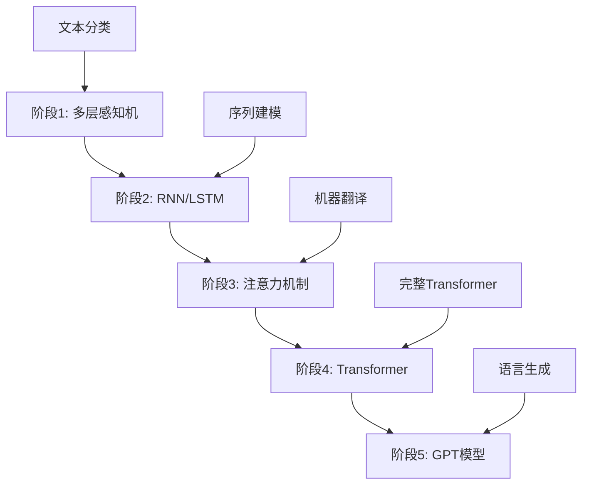

# 大模型学习路径：从感知机到GPT

## 🎯 学习路线图



## 📚 技术演进脉络

### 阶段1：多层感知机 (MLP) - 基础篇
**核心概念：** 前馈神经网络、反向传播、梯度下降

**技术要点：**
- 全连接层的线性变换
- 激活函数的非线性引入
- 损失函数与优化算法
- 过拟合与正则化

**实现亮点：**
- 从零实现前向传播和反向传播
- 多种激活函数对比（ReLU, Sigmoid, Tanh）
- BatchNorm和Dropout的作用机制
- 学习率调度策略

**局限性：**
- 无法处理序列依赖关系
- 输入长度固定
- 缺乏时序记忆能力

---

### 阶段2：RNN/LSTM - 序列建模篇
**核心概念：** 循环连接、隐藏状态、梯度消失/爆炸

**技术突破：**
```python
# RNN的循环机制
h_t = tanh(W_hh * h_{t-1} + W_xh * x_t + b_h)

# LSTM的门控机制
forget_gate = σ(W_f * [h_{t-1}, x_t] + b_f)
input_gate = σ(W_i * [h_{t-1}, x_t] + b_i)
output_gate = σ(W_o * [h_{t-1}, x_t] + b_o)
```

**关键创新：**
- **循环连接**：引入时序记忆
- **门控机制**：解决梯度消失问题
- **双向处理**：捕获前后文信息
- **Teacher Forcing**：稳定训练过程

**应用场景：**
- 文本生成
- 语言建模
- 情感分析
- 命名实体识别

**局限性分析：**
- 顺序计算，无法并行
- 长序列处理能力有限
- 信息瓶颈问题

---

### 阶段3：注意力机制 - 对齐篇
**核心概念：** 动态权重分配、上下文向量、对齐矩阵

**重大突破：**
```python
# 注意力计算的核心公式
e_ij = f(s_{i-1}, h_j)        # 能量函数
α_ij = softmax(e_ij)          # 注意力权重
c_i = Σ_j α_ij * h_j          # 上下文向量
```

**技术对比：**
| 特性 | Bahdanau注意力 | Luong注意力 |
|------|----------------|-------------|
| 计算方式 | 加性 (Additive) | 乘性 (Multiplicative) |
| 复杂度 | 高 | 低 |
| 表达能力 | 强 | 中等 |
| 计算效率 | 低 | 高 |

**关键改进：**
- **信息瓶颈解决**：不再依赖单一向量
- **动态关注**：每步关注不同输入位置
- **可解释性**：注意力权重可视化
- **任务适应性**：适用于多种Seq2Seq任务

**应用拓展：**
- 机器翻译质量显著提升
- 文本摘要更加准确
- 图像描述更加细致

---

### 阶段4：Transformer - 自注意力篇
**核心概念：** 自注意力、多头注意力、位置编码

**革命性变化：**
```python
# 自注意力的核心计算
Attention(Q, K, V) = softmax(QK^T / √d_k) * V

# 多头注意力
MultiHead(Q, K, V) = Concat(head_1, ..., head_h) * W^O
```

**架构优势对比：**
| 模型 | 计算复杂度 | 并行能力 | 长距离依赖 | 可解释性 |
|------|------------|----------|------------|----------|
| RNN | O(n) | 低 | 弱 | 低 |
| CNN | O(1) | 高 | 弱 | 中 |
| Transformer | O(n²) | 高 | 强 | 高 |

**关键组件：**
1. **编码器栈 (Encoder Stack)**
   - 多头自注意力
   - 前馈神经网络
   - 残差连接 + Layer Norm

2. **解码器栈 (Decoder Stack)**
   - 掩码自注意力
   - 编码器-解码器注意力
   - 前馈网络

3. **位置编码 (Positional Encoding)**
   ```python
   PE(pos, 2i) = sin(pos / 10000^(2i/d))
   PE(pos, 2i+1) = cos(pos / 10000^(2i/d))
   ```

**技术突破：**
- **完全并行化**：训练效率大幅提升
- **长距离依赖**：直接建模任意位置关系
- **多头机制**：捕获不同类型的依赖
- **层级表示**：逐层提取抽象特征

---

### 阶段5：GPT模型 - 生成式语言模型篇
**核心概念：** 自回归生成、因果掩码、预训练-微调

**模型演进：**
```
GPT-1 (2018) → GPT-2 (2019) → GPT-3 (2020) → GPT-4 (2023)
117M参数    1.5B参数        175B参数       估计1.7T参数
```

**关键技术：**
1. **自回归语言建模**
   ```python
   P(x_1, ..., x_n) = ∏_{i=1}^n P(x_i | x_1, ..., x_{i-1})
   ```

2. **因果掩码机制**
   - 确保模型只能看到之前的token
   - 防止信息泄漏

3. **预训练-微调范式**
   - 大规模无监督预训练
   - 下游任务微调

**训练策略对比：**
| 策略 | 数据需求 | 计算成本 | 通用性 | 效果 |
|------|----------|----------|--------|------|
| 从零训练 | 大 | 极高 | 高 | 好 |
| 微调 | 小 | 低 | 中 | 很好 |
| 提示学习 | 极小 | 极低 | 极高 | 好 |

**应用场景拓展：**
- 文本生成和续写
- 代码生成和补全
- 问答系统
- 对话系统
- 创意写作
- 翻译和摘要

---

## 🔄 技术传承关系

### 从MLP到RNN：时序建模的引入
```python
# MLP: 静态映射
output = W2 * relu(W1 * input + b1) + b2

# RNN: 引入时序
hidden = tanh(W_h * hidden_prev + W_x * input + b)
output = W_o * hidden + b_o
```

### 从RNN到注意力：信息瓶颈的突破
```python
# RNN: 固定长度编码
context = encoder_final_state

# Attention: 动态上下文
context = Σ attention_weights[i] * encoder_states[i]
```

### 从注意力到Transformer：完全自注意力
```python
# Seq2Seq + Attention: 编码器-解码器注意力
attention(decoder_state, encoder_states)

# Transformer: 自注意力 + 交叉注意力
self_attention(query, key, value)  # 序列内部关系
cross_attention(decoder, encoder)  # 跨序列关系
```

### 从Transformer到GPT：生成式建模
```python
# Transformer: 编码器-解码器架构
encoder_output = transformer_encoder(source)
target = transformer_decoder(target, encoder_output)

# GPT: 仅解码器的自回归生成
next_token = gpt_decoder(context)
```

---

## 📈 性能演进对比

### 计算复杂度分析
| 模型 | 时间复杂度 | 空间复杂度 | 并行度 |
|------|------------|------------|--------|
| MLP | O(d²) | O(d²) | 高 |
| RNN | O(nd²) | O(d) | 低 |
| LSTM | O(nd²) | O(d) | 低 |
| Transformer | O(n²d) | O(n²) | 高 |
| GPT | O(n²d) | O(n²) | 高 |

### 能力对比矩阵
| 能力维度 | MLP | RNN | LSTM | Attention | Transformer | GPT |
|----------|-----|-----|------|-----------|-------------|-----|
| 序列建模 | ❌ | ✅ | ✅ | ✅ | ✅ | ✅ |
| 长距离依赖 | ❌ | ❌ | 🔶 | ✅ | ✅ | ✅ |
| 并行训练 | ✅ | ❌ | ❌ | 🔶 | ✅ | ✅ |
| 可解释性 | 🔶 | ❌ | ❌ | ✅ | ✅ | 🔶 |
| 生成能力 | ❌ | 🔶 | 🔶 | ✅ | ✅ | ✅ |

## 🎓 学习建议

### 循序渐进的学习路径
1. **理论基础** → **代码实现** → **实验验证** → **应用拓展**
2. **单一模型** → **模型对比** → **架构演进** → **性能优化**
3. **小规模数据** → **中等数据** → **大规模数据** → **实际应用**

### 关键检查点
- [ ] 理解反向传播机制
- [ ] 掌握RNN的循环结构
- [ ] 理解注意力机制原理
- [ ] 实现完整的Transformer
- [ ] 训练自己的GPT模型

### 进阶方向
1. **模型压缩**：量化、剪枝、蒸馏
2. **高效训练**：混合精度、梯度累积、分布式训练
3. **应用优化**：推理加速、内存优化、部署优化
4. **前沿技术**：多模态、强化学习、思维链

---

## 🔮 未来展望

### 技术趋势
- **模型规模**：参数量持续增长
- **多模态融合**：文本、图像、音频统一建模
- **效率优化**：更高效的架构设计
- **应用普及**：更多领域的深度应用

### 挑战与机遇
- **计算资源**：如何降低训练和推理成本
- **数据质量**：如何获取高质量训练数据
- **模型理解**：如何提高模型可解释性
- **安全伦理**：如何确保AI系统安全可控

通过完整的学习路径，您将深度理解大模型技术的发展脉络，掌握从基础到前沿的核心技术，为未来的AI研究和应用打下坚实基础！